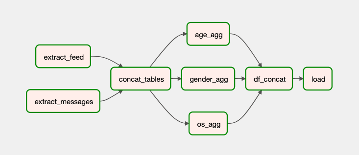
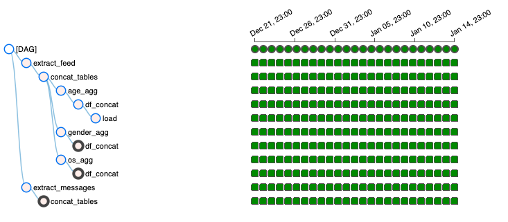
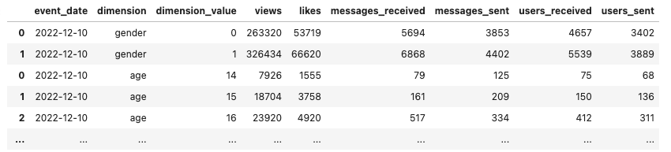

## ETL-pipeline

**Стек:** Python, SQL, Clickhouse, Airflow

Пайплайн выгружает данные из нескольких таблиц базы данных и рассчитывает агрегированные характеристики по некоторым метрикам.

Итоговый датафрейм загружается обратно в базу данных в отдельную таблицу. Процедура повторяется раз в сутки.

Итоговый датафрейм с посчитанными агрегированными метриками в разрезе пола и возраста

